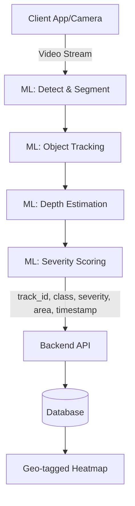

# Edge Vision Road Anomaly & Pothole Severity Index

Welcome to the **Edge Vision Road Anomaly & Pothole Severity Index** repository! This project is being developed for the **Smart India Hackathon (SIH)**.

## 🎯 Problem Statement
Road conditions deteriorate over time, leading to accidents and vehicle damage. Identifying and assessing the severity of potholes and other anomalies in real-time is challenging but crucial for public safety and efficient road maintenance.

## 🚀 Our Solution
We are building a comprehensive system to perform **on-device pothole detection, severity scoring, and a geo-tagged heatmap system**. The project captures video streams (e.g., from a dashcam or smartphone), detects anomalies like potholes using Edge AI, calculates their severity, and reports them to a backend server. The backend then generates a live heatmap of road conditions.

## 🏗️ Repository Architecture

The project is structured into distinct, modular components. Each component has its own dedicated documentation:

| Component | Description |
|---|---|
| [**`ml/`**](ml/README.md) | **Machine Learning Pipeline**. Handles training the models for object detection, segmentation, depth estimation, tracking, and severity scoring. This is the core AI engine. |
| [**`app/`**](app/README.md) | **Client Application**. The mobile/dashcam app responsible for capturing video, acquiring GPS coordinates, running edge inference (future), and uploading event data to the backend. |
| [**`backend/`**](backend/README.md) | **Server & API**. Consumes events from the app, associates them with GPS data, stores them in a database, and generates the road condition heatmap. |
| [**`docs/`**](docs/README.md) | **Documentation**. High-level architecture diagrams, detailed problem statements, meeting notes, and research. |

## ⚙️ System Flow

## 🛠️ Getting Started

If you are a new contributor, please navigate to the respective directory you wish to work on and read its `README.md` for specific setup instructions.

- To train or test the machine learning models, go to [`ml/README.md`](ml/README.md).
- To work on the backend server and APIs, go to [`backend/README.md`](backend/README.md).
- To develop the frontend or mobile application, go to [`app/README.md`](app/README.md).
